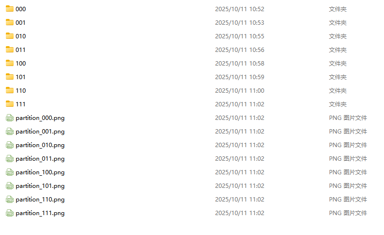
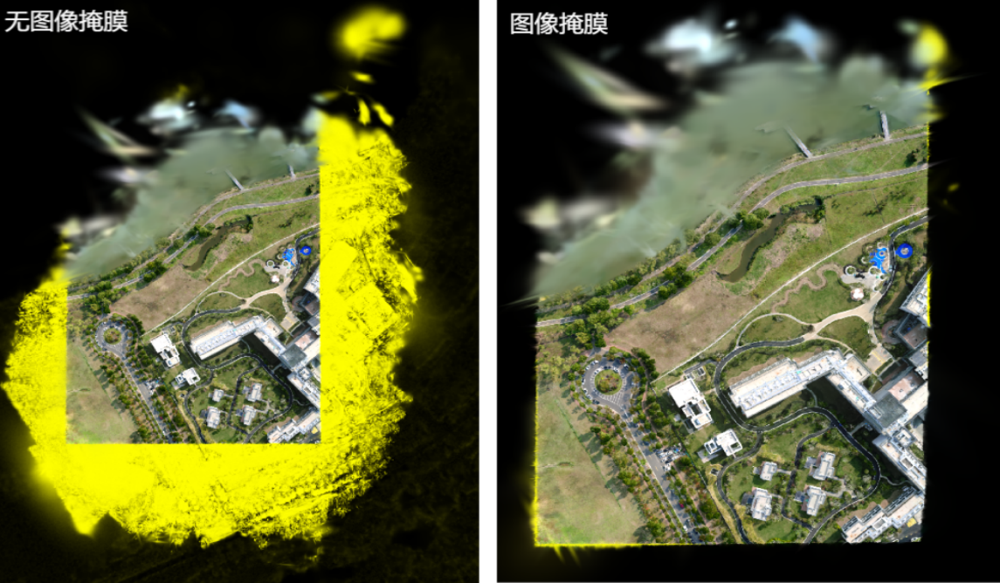
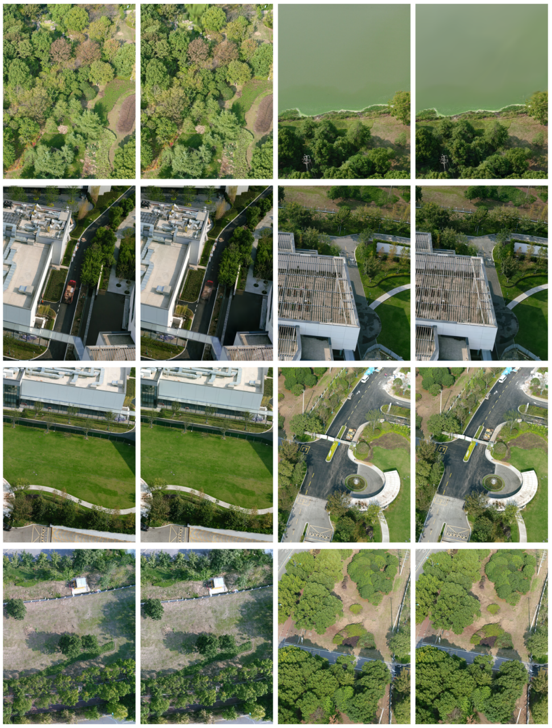

# ptgs

> 基于稀疏点云数量的渐进式场景分区工具，面向 **3D Gaussian Splatting（3DGS）** 数据预处理。
>
> `mask_images` 分支在点云分区的基础上，加入了 **相机可见性筛选** 与 **图像掩膜生成**，用于把大规模 COLMAP 场景拆分为多个可独立训练的 3DGS 子数据集。

---

## 可视化结果

以下图片来自示例数据，仅用于展示分区与掩膜效果。

### 1. 点云分区

脚本会先在 XY 平面上对去噪后的稀疏点云做平衡二分分区，并为每个分区生成分区编号。

<p align="center">
  
</p>

### 2. 图像掩膜对比

对被选中的相机，脚本会把当前分区点云投影到图像平面，计算可见区域的凸包，并将凸包外的内容置黑，从而减少跨分区内容对训练的干扰。

<p align="center">
  
</p>

### 3. 渲染结果

<p align="center">
  
</p>

### 4. 训练演示

- [查看完整训练过程 GIF](./assets/train_result.gif)
  该 GIF 体积较大，README 中不直接内嵌。
- [查看 Lichtfeld 数据集训练结果大图](./assets/use_lichtfeld_train.png)

---

## 功能

- 读取 COLMAP 稀疏重建结果
- 对稀疏点云做离群点过滤
- 根据点云数量在 XY 平面上做递归二分分区
- 自动扩展分区范围，并把相机分配到对应分区
- 通过点云投影和凸包计算筛选可见相机
- 生成 `<原文件名>_m.<扩展名>` 格式的掩膜图
- 为每个分区导出可直接用于 3DGS 训练的 COLMAP 子数据集
- 输出分区总览图与单分区可视化图

---

## 仓库结构

```text
ptgs/
├── main.py                     # 入口脚本
├── data_read/
│   ├── cameras.py              # 相机对象
│   ├── colmap_loader.py        # COLMAP 读写
│   ├── create_scene.py         # 场景与分区数据结构
│   ├── graphics_utils.py       # 几何工具
│   └── read_write_model.py     # COLMAP 模型序列化
├── partition/
│   ├── partition_run.py        # 分区主流程
│   ├── run_def.py              # 分区、扩展、可见性筛选与掩膜生成
│   ├── save_partition.py       # 子场景导出
│   └── plot_partition.py       # 分区可视化
└── assets/                     # 可视化结果
```

---

## 环境依赖

推荐使用 **Python 3.10**。

```bash
conda create -n ptgs python=3.10
conda activate ptgs

pip install numpy scipy shapely plyfile matplotlib opencv-python open3d
```

`torch` 需要根据本机环境安装：

```bash
# CPU 版本
pip install torch

# CUDA 12.1 示例
pip install torch --index-url https://download.pytorch.org/whl/cu121
```

> 仓库当前未提供 `environment.yml` 或 `requirements.txt`，以上命令按代码实际依赖整理。

---

## 输入数据格式

脚本默认读取标准 COLMAP 输出结构：

```text
dataset/
├── images/
│   ├── image_0001.jpg
│   ├── image_0002.jpg
│   └── ...
└── sparse/
    └── 0/
        ├── cameras.bin
        ├── images.bin
        └── points3D.bin
```

说明：

- `cameras.bin` / `images.bin` / `points3D.bin` 可替换为对应的 `.txt` 文件。
- 如果 `points3D.ply` 不存在，脚本会尝试从 `points3D.bin` 或 `points3D.txt` 自动生成。
- 当前代码只支持 **PINHOLE** 和 **SIMPLE_PINHOLE** 相机模型。
- 原图目录中会额外生成 `<原文件名>_m.<扩展名>` 的掩膜图，原图本身不会被修改。

---

## 使用方法

在仓库根目录运行：

```bash
python main.py /path/to/dataset
```

Windows 示例：

```powershell
python main.py "D:\data\airport"
```

如果不在仓库根目录运行，需要设置 `PYTHONPATH`：

```powershell
$env:PYTHONPATH = "C:\path\to\ptgs"
python main.py "D:\data\airport"
```

Linux / macOS 示例：

```bash
PYTHONPATH=/path/to/ptgs python main.py /path/to/dataset
```

---

## 配置参数

| 参数 | 默认值 | 位置 | 说明 |
| --- | ---: | --- | --- |
| `threshold_value` | `500000` | `main.py` | 单个分区的目标点云数量阈值，值越小，分区数量越多 |
| `visible_rate_threshold` | `0.3` | `partition/run_def.py` | 相机可见性阈值，值越大，筛选越严格 |
| `voxel_size` | `0.1` | `partition/run_def.py` | 可见性计算前的点云下采样体素大小 |
| `max_workers` | `48` | `partition/run_def.py` | 相机可见性计算的并行线程数 |
| `expand_ratio` | `0.10` | `partition/run_def.py` | 点云分区边界扩展比例 |
| `quantile` | `0.95` | `partition/run_def.py` | 计算相机扩展距离时使用的分位数 |
| `max_xy_clip` | `200.0` | `partition/run_def.py` | 相机到可见点云 XY 距离的裁剪上限 |
| `radius` | `1.0` | `partition/run_def.py` | 半径离群点过滤半径 |
| `min_points` | `5` | `partition/run_def.py` | 半径离群点过滤的最少邻居点数 |

> 如果训练时出现显存不足，可以适当降低 `threshold_value`。

---

## 输出结果

脚本会在输入数据目录下生成 `model/split_result/`：

```text
dataset/
└── model/
    └── split_result/
        ├── partition_overview.png
        ├── partition_<id>.png
        └── visible/
            └── <partition_id>/
                └── partition_<partition_id>/
                    ├── images/
                    │   └── <image_name>_m.<ext>
                    ├── sparse/
                    │   └── 0/
                    │       ├── cameras.bin
                    │       ├── images.bin
                    │       └── points3D.bin
                    └── partition_<partition_id>.pkl
```

其中：

- `partition_overview.png` 是全部分区的总览图。
- `partition_<id>.png` 是单个分区的点云与相机分布图。
- `visible/<partition_id>/partition_<partition_id>/` 是一个可直接用于 3DGS 训练的子场景。
- `images/` 中保存的是当前分区对应的掩膜图。
- `.pkl` 文件保存分区的调试与中间信息，不是 3DGS 训练的必需文件。

---

## 注意事项

1. 本仓库只负责 **分区、相机筛选、掩膜生成和子场景导出**，不包含 3DGS 训练与模型合并脚本。
2. `mask_images` 分支会在原图目录中写入 `_m` 后缀的掩膜图，请确保该目录可写。
3. 如果分区结果过大或过小，优先调整 `main.py` 中的 `threshold_value`。
4. 如果相机筛选结果过少，可以适当降低 `visible_rate_threshold`。
5. 输入 COLMAP 模型应尽量使用去畸变后的 PINHOLE / SIMPLE_PINHOLE 数据。

---

## 相关项目

- [Based-on-point-cloud-partitions](https://github.com/1799967694/Based-on-point-cloud-partitions)
- [VastGaussian-refactor](https://github.com/1799967694/VastGaussian-refactor)
